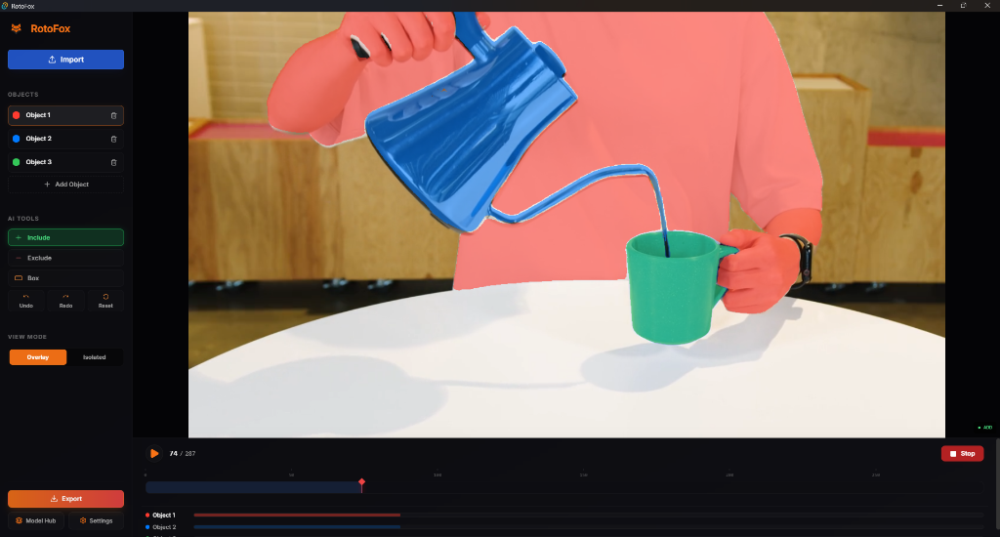
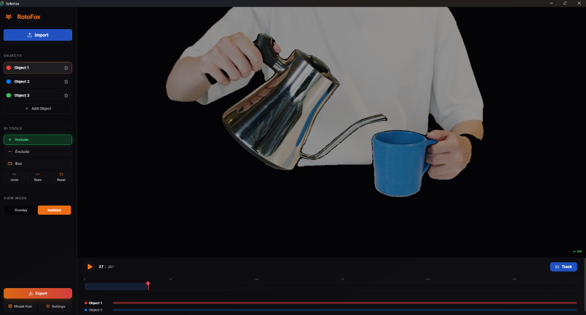
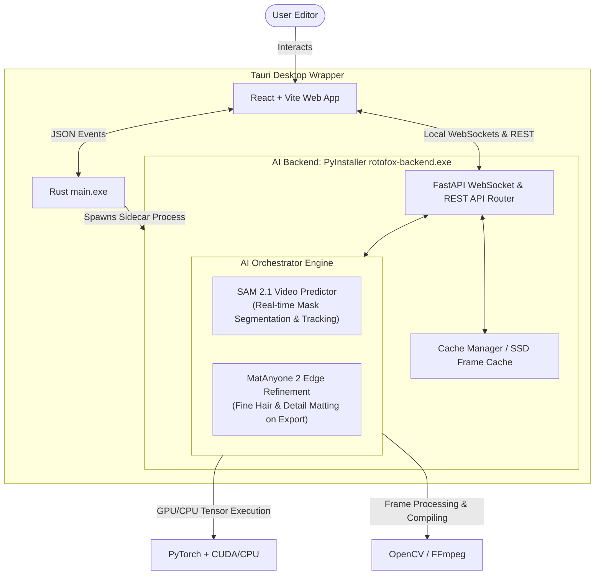

<div align="center">

# 🦊 RotoFox — Smart Mask Local

**Offline, AI-Powered Rotoscoping & Video Segmentation for Editors**

[](https://react.dev)
[](https://fastapi.tiangolo.com)
[](https://pytorch.org)
[](https://github.com/facebookresearch/segment-anything-2)
[](https://tauri.app)
[](https://opensource.org/licenses/MIT)

*The local alternative to After Effects Roto Brush & Runway — runs fully offline on your own GPU/CPU.*

</div>

---

## 🖥️ Application Interface (Before / After)

| Before: Overlay View Mode (Real-time Mask Track) | After: Isolated View Mode (Background Removed) |
| :---: | :---: |
|  |  |

---

## 📖 What is RotoFox?

**RotoFox** is a desktop-grade, 100% offline rotoscoping tool. It lets video editors and filmmakers automate the process of creating precise **video masks** — separating subjects from backgrounds — using the power of **Meta's Segment Anything Model 2 (SAM 2.1)** and **MatAnyone 2** for ultra-fine edge refinement (capturing fine details like hair strands, semi-transparent smoke, and motion blur).

Instead of frame-by-frame manual masking, RotoFox lets you **click once** (or draw a box) on a subject, and the AI automatically tracks and generates the mask across the entire video timeline. All computation runs locally on your own machine (supporting GPU CUDA acceleration as well as CPU fallbacks) — your footage never leaves your machine.

---

## ✨ Core Features

| Feature | Description |
|:---|:---|
| 🖱️ **Interactive Point-and-Click** | Left-click (Include / green dot) to define the foreground object. Right-click (Exclude / red dot) to exclude background leaks. |
| 🟦 **Box Selection Mode** | Draw a bounding box around the subject for fast, precise localization prompts. |
| 🤖 **AI Propagation** | Streams mask predictions frame-by-frame across the timeline using SAM 2's Video Predictor memory bank. |
| 💇 **Hair-Level Matting** | Integrates MatAnyone 2 to refine boundaries, producing high-quality alpha matte edges. |
| ↩️ **Undo / Redo History** | Full state history with keyboard shortcuts (`Ctrl+Z`, `Ctrl+Y`, `Ctrl+Shift+Z`) synced dynamically to the AI backend. |
| 🎞️ **Multi-Object Timeline** | Visual timeline controller supporting up to 7 concurrent, color-coded mask layers with real-time feedback. |
| ⌨️ **Editor-Friendly Shortcuts** | Navigation designed for standard NLE workflows (Arrow keys, Spacebar, Page Up/Down, Home/End). |
| 📤 **Production-Ready Exports** | Export masks as transparent **ProRes 4444 (.mov)** or a **Luma Matte Sequence** (grayscale PNG images). |
| 🔒 **100% Secure & Offline** | Zero external API calls, tracking, or telemetry — works fully offline. |

---

## 📁 Detailed Directory Structure

Below is the layout of the project, explaining the roles of the main directories and files:

```
Smart Mask Local/
├── backend/
│   ├── main.py                  # FastAPI server entry point (restores WebSocket & API routes)
│   ├── requirements.txt         # Python dependencies (PyTorch, OpenCV, FastAPI, etc.)
│   ├── rotofox-backend.spec     # PyInstaller spec configuration for packaging the backend binary
│   ├── app/
│   │   ├── api/
│   │   │   ├── routes.py        # REST endpoints (handles video upload & setup wizards)
│   │   │   └── websockets.py    # WebSocket communication (processes click/box actions, tracking, exports)
│   │   ├── core/
│   │   │   └── engine_state.py  # Centralized tracking progress & cancellation controller
│   │   └── services/
│   │       ├── ai_engine.py     # Orchestrates SAM 2 & MatAnyone 2 models, exports, and math conversions
│   │       ├── cache_manager.py # Handles SSD storage directory caching for JPG frame extracts
│   │       ├── memory_manager.py# Manages system garbage collection and CUDA VRAM clearing
│   │       ├── model_manager.py # Profiles hardware, recommends models, and runs download hub
│   │       └── video_processor.py# Decodes video frames via OpenCV, handles FPS limits & resource closing
│   └── scripts/
│       ├── package_backend.py   # Script to package backend python scripts into a standalone sidecar
│       ├── setup_models.py      # Automated download utility for AI weights
│       └── setup_sam2.py        # Installs Segment Anything 2 module locally
├── frontend/
│   ├── package.json             # NPM dependencies & build scripts
│   ├── vite.config.js           # Vite server configuration
│   ├── src/
│   │   ├── App.jsx              # Main UI controller, states, dialog popups, and WebSocket listener
│   │   ├── index.css            # Styling core (dark-mode glassmorphic theme)
│   │   ├── hooks/
│   │   │   └── useAIEngine.js   # Custom React hook wrapper for the WebSocket server connection
│   │   └── components/
│   │       ├── canvas/
│   │       │   └── VideoCanvas.jsx  # Interactive canvas displaying video, prompts (dots/boxes), and masks
│   │       ├── layout/          # UI framework layouts
│   │       ├── setup/
│   │       │   └── SetupWizard.jsx  # Wizard helping download models on first run
│   │       ├── sidebar/
│   │       │   └── Toolbar.jsx      # toolbar for tools selection (Include, Exclude, Box, Export, Model Hub)
│   │       └── timeline/
│   │           └── TimelineController.jsx # Media timeline scrubbing, play/pause, frame tracks
│   └── src-tauri/
│       ├── tauri.conf.json      # Desktop application wrapper configurations
│       ├── Cargo.toml           # Rust package configuration
│       └── src/
│           ├── main.rs          # Tauri execution entry point
│           └── lib.rs           # Rust application setup (spawns PyInstaller sidecar binary automatically)
├── dist/                        # Holds portable distribution builds
├── docs/                        # Project documentation files (diagrams, walkthroughs)
├── run_all.bat                  # Developer shortcut: starts backend server and Vite frontend concurrently
├── run_backend.bat              # Dev shortcut: launches Python backend server
├── build_portable.bat           # Production builder: packages application into a portable zip folder
└── setup_and_build.bat          # Complete setup script: installs Node modules, Python venv, and builds target release
```

---

## 🏗️ System Architecture & Workflow

RotoFox uses a **Local Hybrid Architecture** where the Tauri-wrapped frontend communicates with a Python AI backend sidecar via local WebSockets and REST APIs.

### 1. Architectural Layout



### Core Backend AI Modules:
- **Meta's SAM 2.1 (Segment Anything Model 2.1)**: Runs real-time video segmentation. When you place click prompts (include/exclude) or draw bounding boxes, SAM 2.1 predicts the subject's mask on the current frame and propagates (tracks) that mask forwards/backwards across the timeline frames using its memory attention bank.
- **MatAnyone 2**: Runs edge matte refinement during the project export phase. Coarse masks generated by SAM 2.1 are automatically sent to MatAnyone 2 to compute sub-pixel transparency (alpha mattes) for challenging edges like hair strands, smoke, transparency, and motion blur.

---

### 2. Processing Pipeline

1. **Import & Downsample**: When a video is uploaded, the backend downsamples high-frame-rate clips to a default of **30 FPS** to prevent high RAM/VRAM usage. OpenCV extracts these frames into a cached JPEG directory (`cache_workspace/video_<timestamp>/`).
2. **Interactive Prompting**: The editor inputs point or box prompts on the canvas. The frontend sends the coordinates to the backend, which feeds them into SAM 2 and sends back a base64 encoded PNG mask overlay.
3. **Timeline Propagation**: When "Track Forward" is triggered, the SAM 2 Video Predictor runs propagation over the timeline, streaming progress packets back to the client.
4. **MatAnyone 2 Edge Refinement**: During export, SAM 2's coarse masks pass through the MatAnyone 2 neural net to refine fine details (like hair, transparency, or motion blur).
5. **Compositing**: OpenCV compiles the processed frames and masks to write the final output video format.

---

## 💻 Installation & Setup

### 🚀 Developer Quickstart (Local Run)

Double-click the [run_all.bat](run_all.bat) script at the project root. This launcher automatically spins up the Python backend server and the Vite dev server in separate terminal windows.

### Prerequisites
- **OS**: Windows 10/11 or Ubuntu Linux
- **Python**: version `3.10` or higher (Python `3.11`/`3.12` recommended)
- **Node.js**: version `18` or `20` (installed with npm)
- **GPU**: NVIDIA GPU with **4 GB+ VRAM** (CUDA 11.8+ installed) is recommended. (Runs on CPU but is slow).

---

### Manual Step-by-Step Developer Setup

#### 1. Backend Setup
```bash
# Navigate to the backend directory
cd backend

# Create a virtual environment
python -m venv .venv

# Activate the virtual environment
# Windows:
.venv\Scripts\activate
# Linux/macOS:
source .venv/bin/activate

# Install dependencies
pip install -r requirements.txt

# Setup SAM 2
python scripts/setup_sam2.py

# Download AI Models (or download later via the Model Hub in the UI)
python scripts/setup_models.py

# Run the backend
python main.py
```

#### 2. Frontend Setup
```bash
# Navigate to the frontend directory
cd ../frontend

# Install node packages
npm install

# Option A: Run in browser
npm run dev

# Option B: Run as a desktop application
npm run tauri dev
```

---

## 📦 Building for Production

If you want to package RotoFox into a single, production-ready desktop installation wizard (`.exe`), follow these steps:

### 1. Automated Installation Setup & Build
Simply double-click [setup_and_build.bat](setup_and_build.bat). It will automatically:
1. Create the backend Python virtual environment.
2. Install Python dependencies and configure SAM 2.
3. Package the Python backend into a standalone folder using PyInstaller.
4. Run `npm install` and compile the Tauri app into an installer executable.

### 2. Standalone Installer Path
Once built, you can find the single installation wizard at:
`frontend/src-tauri/target/release/bundle/nsis/RotoFox_1.0.0_x64-setup.exe`

Double-clicking this file installs the desktop app. Running the installed shortcut automatically runs the React interface and launches the Python AI backend sidecar invisibly in the background.

---

## ⌨️ Keyboard Shortcuts

| Key Shortcut | Action |
|:---|:---|
| `Spacebar` | Play / Pause timeline playback |
| `←` / `→` | Seek backward / forward **1 frame** |
| `Page Up` | Jump forward **10 frames** |
| `Page Down` | Jump backward **10 frames** |
| `Home` | Jump to **first frame** |
| `End` | Jump to **last frame** |
| `Ctrl + Z` | **Undo** last prompt (point or box) |
| `Ctrl + Y` or `Ctrl + Shift + Z` | **Redo** last undone action |

---

## 🤝 Contributing

Contributions are welcome! Please follow these guidelines:
1. Fork this repository.
2. Create a branch: `git checkout -b feature/amazing-feature`.
3. Commit your changes following [Conventional Commits](https://www.conventionalcommits.org/).
4. Push to the branch and open a Pull Request.

---

## 📄 License

This project is licensed under the **MIT License**. See the [LICENSE](LICENSE) file for more details.

---

<div align="center">
Made with ❤️ for editors and creators who want premium local tools.<br>
<b>RotoFox</b> — because every frame of your story matters. 🦊🎬
</div>
