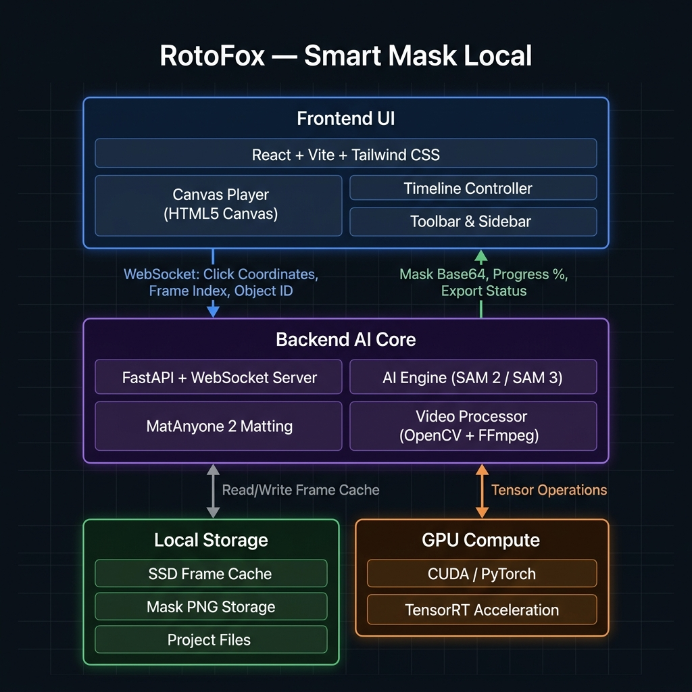
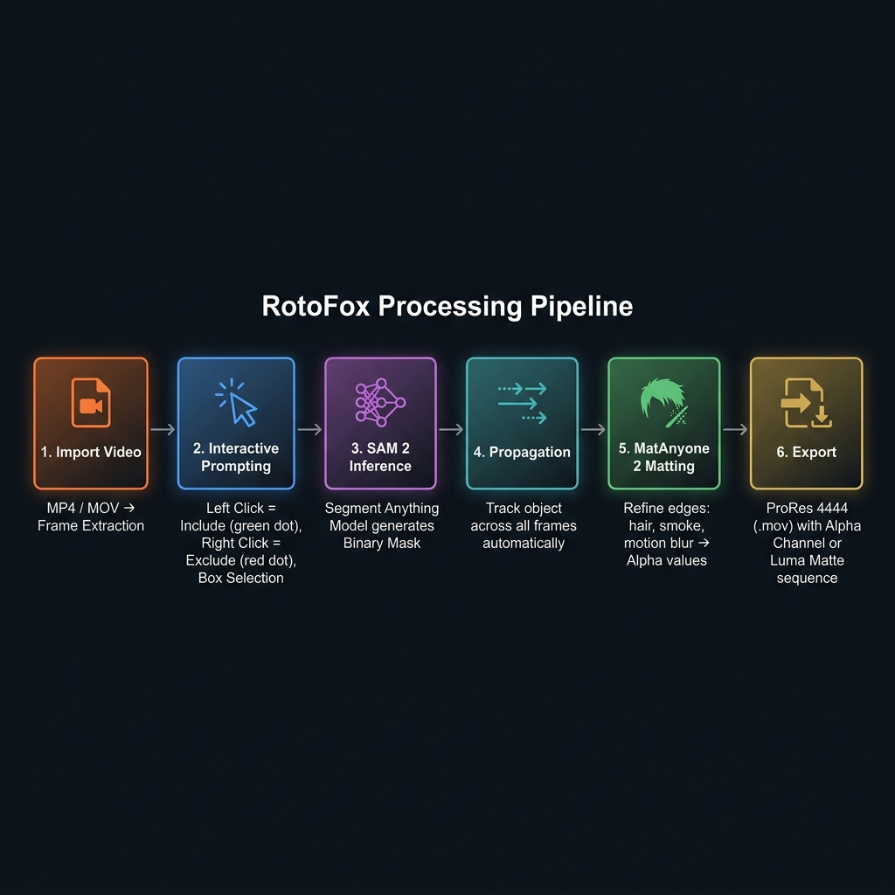

<div align="center">

# 🦊 RotoFox — Smart Mask Local

**Offline, AI-powered Rotoscoping & Video Segmentation for Editors**

[](https://react.dev)
[](https://fastapi.tiangolo.com)
[](https://pytorch.org)
[](https://github.com/facebookresearch/segment-anything-2)
[](https://opensource.org/licenses/MIT)

*The local alternative to After Effects Roto Brush & Runway — runs fully offline on your own GPU.*

</div>

---

## 📖 What is RotoFox?

**RotoFox** is a desktop-grade, 100% offline rotoscoping tool. It lets video editors and filmmakers automate the process of creating precise **video masks** — separating subjects from backgrounds — using the power of **Meta's Segment Anything Model 2 (SAM 2)** and **MatAnyone 2** for ultra-fine edge refinement (hair, smoke, motion blur).

Instead of frame-by-frame manual masking, RotoFox lets you **click once** on a subject and AI automatically tracks and generates the mask across the entire video timeline. All computation runs locally on your own NVIDIA GPU — your footage never leaves your machine.

---

## ✨ Core Features

| Feature | Description |
|:---|:---|
| 🖱️ **Interactive Point-and-Click** | Left-click (Include / green dot) to define foreground, Right-click (Exclude / red dot) to clean up background leaks |
| 🟦 **Box Selection Mode** | Draw a bounding box on the canvas for precise local segmentation prompts |
| 🤖 **AI Propagation** | One click propagates the mask across all frames using SAM 2's Video Predictor memory bank |
| 💇 **Hair-Level Matting** | MatAnyone 2 refines mask edges to capture hair strands, semi-transparent smoke, and motion blur |
| ↩️ **Undo / Redo History** | Full state history with keyboard shortcuts (`Ctrl+Z`, `Ctrl+Y`, `Ctrl+Shift+Z`) synced to the backend |
| 🎞️ **Timeline with Object Tracks** | Visual per-object track showing mask coverage across frames (up to 7 concurrent layers) |
| ⌨️ **Keyboard Timeline Seek** | Arrow keys (1 frame), Page Up/Down (10 frames), Home/End for fast navigation |
| 📤 **Pro Export Suite** | Export as **ProRes 4444 (.mov)** with alpha channel or a **Luma Matte Sequence** (grayscale PNGs) |
| 🔒 **100% Offline & Secure** | Zero network calls during inference — your footage stays on your machine |

---

## 🏗️ System Architecture

RotoFox uses a **Local Hybrid Architecture** where a React frontend communicates with a Python AI backend via a local WebSocket server.



```
┌─────────────────────────────────────────────────────────────────┐
│                    FRONTEND  (React + Vite)                     │
│  Canvas Player · Timeline Controller · Toolbar Sidebar          │
└──────────────────────────┬──────────────────────────────────────┘
           WebSocket ↓ Send │ Click Coords, Frame Index, Object ID
           WebSocket ↑ Recv │ Mask Base64, Progress %, Export Status
┌──────────────────────────┴──────────────────────────────────────┐
│                BACKEND AI CORE  (FastAPI + PyTorch)             │
│  AI Engine (SAM 2/SAM 3) · MatAnyone 2 · Video Processor       │
└──────┬───────────────────────────────────────────┬─────────────┘
       │ Read/Write Frame Cache                    │ CUDA Tensors
┌──────┴────────────┐                   ┌──────────┴──────────────┐
│   LOCAL STORAGE   │                   │     GPU COMPUTE         │
│  SSD Frame Cache  │                   │  PyTorch + CUDA         │
│  Mask PNG Store   │                   │  TensorRT Acceleration  │
└───────────────────┘                   └─────────────────────────┘
```

### Key Components

- **`frontend/src/App.jsx`** — Root app managing WebSocket connection, global state (objects, masks, history), and all component orchestration
- **`frontend/src/components/canvas/VideoCanvas.jsx`** — HTML5 Canvas rendering video frames, drawing click prompts (dots/boxes), and compositing mask overlays
- **`frontend/src/components/timeline/`** — Frame slider, object tracks, and playback controls
- **`backend/app/api/websockets.py`** — WebSocket router handling actions: `click`, `track_forward`, `export`, `get_mask`, `remove_object`, `clear_clicks`
- **`backend/app/services/ai_engine.py`** — Core AI orchestration: SAM 2 inference, propagation loop, MatAnyone 2 matting, and export pipeline
- **`backend/app/services/video_processor.py`** — FFmpeg/OpenCV video decoding and frame cache management

---

## 🔄 Processing Pipeline

The end-to-end workflow from import to export:



```
 Import         Prompt         SAM 2           Propagate       MatAnyone 2      Export
 Video    →    Canvas     →    Inference  →    All Frames  →   Edge Refine  →  ProRes/Luma
  │               │               │               │                │              │
MP4/MOV      Left Click =     Binary Mask     Memory Bank      Alpha Matte    .mov ProRes 4444
 ↓           Include (🟢)    per frame       auto-tracks      hair / blur    or PNG sequence
Frame        Right Click =   sent to UI       object fwd      is computed
Extraction   Exclude (🔴)   as Base64        & backward      from trimap
             Box Draw
```

**Detailed Steps:**

1. **Import & Decode** — User uploads a video. Backend uses OpenCV/FFmpeg to decode all frames into a local SSD frame cache for fast random access during timeline scrubbing.
2. **Interactive Prompting** — User clicks on the canvas. The frontend sends `{ points, labels, frame_idx, obj_id }` over WebSocket. SAM 2's image encoder creates an embedding and the decoder immediately returns a binary mask.
3. **Real-time Mask Overlay** — The returned `mask_base64` is drawn as a colored transparent overlay on the canvas in real time.
4. **AI Propagation** — User clicks "Track Forward/Backward." The SAM 2 Video Predictor streams mask updates frame-by-frame, sending progress events back to the UI.
5. **MatAnyone 2 Matting** — The coarse SAM masks are passed through MatAnyone 2, which computes precise alpha matte values for fine edges (hair, smoke, motion blur).
6. **Export** — FFmpeg composes the final alpha channel video (ProRes 4444 `.mov`) or outputs a PNG luma matte sequence.

---

## 💻 Getting Started

### Prerequisites

| Requirement | Version |
|:---|:---|
| OS | Windows 10/11 or Ubuntu Linux |
| Python | `3.10` or higher |
| Node.js | `18` or `20` |
| GPU | NVIDIA GPU with **6 GB+ VRAM** (CUDA 11.8+) |
| FFmpeg | Any recent version (must be in `PATH`) |

> **CPU-only mode:** Supported but will be significantly slower (not recommended for video longer than ~30 seconds).

---

### Step 1 — Backend Setup

```bash
# 1. Navigate to the backend directory
cd backend

# 2. Create a Python virtual environment
python -m venv .venv

# 3. Activate the virtual environment
#    Windows:
.venv\Scripts\activate
#    macOS / Linux:
source .venv/bin/activate

# 4. Install dependencies
pip install -r requirements.txt

# 5. Start the backend server  (listens on ws://localhost:8000)
python main.py
```

> 💡 **Windows shortcut:** Double-click `run_backend.bat` in the project root.

The backend will automatically detect your hardware (VRAM, RAM) and configure appropriate model variants on first launch.

---

### Step 2 — Frontend Setup

```bash
# 1. Navigate to the frontend directory
cd frontend

# 2. Install Node dependencies
npm install

# 3a. Launch in browser (Vite dev server)
npm run dev

# 3b.  OR launch as a desktop app (requires Tauri CLI)
npm run tauri dev
```

Open `http://localhost:5173` in your browser. The frontend auto-connects to the backend WebSocket at `ws://localhost:8000/ws/editor`.

---

## ⌨️ Keyboard Shortcuts

| Shortcut | Action |
|:---|:---|
| `Space` | Play / Pause playback |
| `←` `→` | Seek backward / forward **1 frame** |
| `Page Up` | Seek forward **10 frames** |
| `Page Down` | Seek backward **10 frames** |
| `Home` | Jump to **first frame** |
| `End` | Jump to **last frame** |
| `Ctrl + Z` | **Undo** last prompt (point or box) |
| `Ctrl + Y` or `Ctrl + Shift + Z` | **Redo** last undone action |

---

## 🛠️ Technology Stack

### Backend (AI Core)

| Technology | Role |
|:---|:---|
| **Python 3.10+** | Core language |
| **FastAPI** | Async WebSocket & REST API server |
| **SAM 2 / SAM 3** | Object segmentation & cross-frame tracking |
| **MatAnyone 2** | Alpha matte refinement (hair, smoke, blur) |
| **PyTorch + CUDA** | GPU-accelerated tensor computation |
| **OpenCV** | Frame decoding, binary mask operations |
| **FFmpeg / PyAV** | Video encoding / ProRes 4444 export |

### Frontend (UI)

| Technology | Role |
|:---|:---|
| **React 18 + Vite** | UI framework & hot-reload dev server |
| **Tailwind CSS** | Utility-first dark-mode styling |
| **HTML5 Canvas API** | Real-time mask overlay & click prompt rendering |
| **Lucide React** | Icon library |
| **Tauri** | Desktop app wrapper (optional, lighter than Electron) |

---

## 📁 Project Structure

```
Smart Mask Local/
├── backend/
│   ├── main.py                  # FastAPI app entry point
│   ├── requirements.txt
│   └── app/
│       ├── api/
│       │   ├── routes.py        # REST endpoints (video upload)
│       │   └── websockets.py    # WebSocket action handler
│       ├── core/
│       │   └── engine_state.py  # Shared AI engine state (tracking, cancel)
│       └── services/
│           ├── ai_engine.py     # SAM 2 + MatAnyone 2 orchestration
│           ├── video_processor.py
│           ├── cache_manager.py
│           └── memory_manager.py
├── frontend/
│   └── src/
│       ├── App.jsx              # Root component & WebSocket manager
│       ├── index.css
│       └── components/
│           ├── canvas/
│           │   └── VideoCanvas.jsx   # HTML5 Canvas + mask renderer
│           ├── sidebar/
│           │   └── Toolbar.jsx       # AI tools, object list, export panel
│           ├── timeline/             # Playback controls & frame tracks
│           └── layout/
├── docs/                        # Architecture & workflow diagrams
├── run_backend.bat              # Windows one-click backend launcher
└── README.md
```

---

## 🚧 Development Roadmap

- [x] **Phase 1** — PoC: SAM 2 + MatAnyone 2 pipeline validation
- [x] **Phase 2** — Backend Engine: FastAPI WebSocket server, SSD frame cache, memory optimization
- [x] **Phase 3** — Frontend UI: Interactive canvas, timeline controller, undo/redo, export panel
- [ ] **Phase 4** — Deployment: One-click installer, Model Hub (auto GPU detection + checkpoint download), Beta v1.0

---

## ⚡ Performance Notes

| GPU | VRAM | Recommended Model | Expected Speed |
|:---|:---|:---|:---|
| RTX 3060 | 8 GB | SAM 2 Small | ~10–15 FPS propagation |
| RTX 3070 / 4060 | 8 GB | SAM 2 Base+ | ~15–20 FPS |
| RTX 3090 / 4090 | 16–24 GB | SAM 2 Large | ~25–30 FPS |
| CPU only | — | SAM 2 Tiny | ~1–2 FPS |

> Enable **TensorRT** optimization in settings for an additional ~30–50% speed boost on supported NVIDIA GPUs.

---

## 🤝 Contributing

Contributions, bug reports, and feature requests are welcome!

1. Fork the repository
2. Create a feature branch: `git checkout -b feature/my-feature`
3. Commit your changes: `git commit -m "feat: add my feature"`
4. Push to your branch: `git push origin feature/my-feature`
5. Open a Pull Request

Please follow [Conventional Commits](https://www.conventionalcommits.org/) for commit messages.

---

## 📄 License

Released under the **MIT License**. See [LICENSE](LICENSE) for details.

---

<div align="center">
Made with ❤️ for rotoscoping editors who deserve better tools.<br>
<b>RotoFox</b> — because every frame of your story matters. 🦊🎬
</div>
