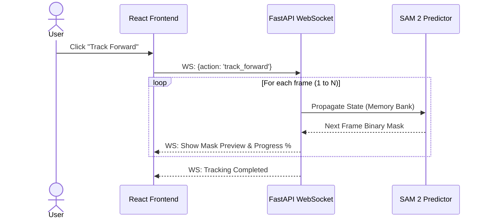

# KIẾN TRÚC HỆ THỐNG: SMARTMASK LOCAL
*(System Architecture Design)*

Tài liệu này mô tả chi tiết kiến trúc kỹ thuật của hệ thống SmartMask Local, giải thích luồng hoạt động, cấu trúc thành phần và phương thức giao tiếp giữa giao diện người dùng và lõi xử lý AI nội bộ.

---

## 1. TỔNG QUAN KIẾN TRÚC (HIGH-LEVEL ARCHITECTURE)

SmartMask Local tuân theo mô hình **Local Hybrid Architecture**, phân tách rõ ràng giữa lớp Hiển thị (Frontend) và lớp Xử lý (Backend), đóng gói trong một ứng dụng Desktop duy nhất. 

- **Frontend (Tauri + React):** Đảm nhiệm việc hiển thị Video, tiếp nhận tương tác chuột (Clicks, Drags), quản lý Timeline và gửi lệnh qua API/WebSockets.
- **Backend (Python FastAPI):** Nhận lệnh từ Frontend, điều khiển phần cứng GPU xử lý hình ảnh qua 2 mô hình AI (SAM 2 & MatAnyone 2), và quản lý dữ liệu Video cache trên đĩa cứng (SSD).

---

## 2. BIỂU ĐỒ THÀNH PHẦN (COMPONENT DIAGRAM)

Biểu đồ dưới đây thể hiện sự liên kết giữa các cụm thành phần chính:

```mermaid
graph TD
    subgraph "Frontend (Tauri + React)"
        UI[User Interface]
        Canvas[Video & Mask Canvas]
        Timeline[Timeline Manager]
        WS_Client[WebSocket Client]
        
        UI --> Canvas
        UI --> Timeline
        Canvas --> WS_Client
        Timeline --> WS_Client
    end

    subgraph "Backend (Python FastAPI)"
        WS_Server[WebSocket Server]
        API[REST API endpoints]
        
        subgraph "AI Core Processing"
            SAM2[SAM 2 Service<br/>(Tracking & Segmentation)]
            MatAnyone[MatAnyone 2 Service<br/>(Matting & Refinement)]
        end
        
        subgraph "I/O & Storage Core"
            VideoUtil[OpenCV/FFmpeg Utils]
            Cache[(SSD Frame Cache)]
        end
        
        WS_Server <--> SAM2
        API --> VideoUtil
        VideoUtil --> Cache
        SAM2 <--> Cache
        MatAnyone <--> Cache
        SAM2 -->|Raw Mask| MatAnyone
    end

    WS_Client <==>|Bi-directional Data (JSON / Base64)| WS_Server
```

---

## 3. LUỒNG XỬ LÝ CHÍNH (DATA FLOWS)

Hệ thống có 4 luồng xử lý dữ liệu chính tương ứng với hành vi của người dùng:

### 3.1. Luồng Import Video (Khởi tạo)
1. Người dùng chọn file Video.
2. Frontend gửi request REST API `/upload` xuống Backend.
3. Backend sử dụng **FFmpeg / OpenCV** rã video thành chuỗi ảnh (`.jpg` hoặc `.png` để lossless) và lưu vào thư mục `cache_workspace/`.
4. Backend nạp file ảnh Frame đầu tiên vào bộ nhớ của **SAM 2 Image Encoder**.
5. Gửi tín hiệu "Sẵn sàng" lại cho Frontend.

### 3.2. Luồng Tương Tác Chuột (Point-and-Click Inference)
Để đảm bảo trải nghiệm vẽ Mask theo thời gian thực (Zero-latency feel), chúng ta sử dụng **WebSockets**:
1. Người dùng Click chuột trên Canvas (Tọa độ X, Y).
2. Frontend gửi tọa độ qua WebSocket: `{ action: "click", type: "positive", coords: [X,Y], frame_idx: 0 }`.
3. Backend gọi hàm SAM 2 Predictor tính toán, trả về ma trận Binary Mask.
4. Backend mã hóa Mask thành ảnh Base64 PNG siêu nhẹ và đẩy qua WebSocket về Frontend.
5. Frontend Overlay Mask màu lên Video ngay lập tức.

### 3.3. Luồng Tracking Tự Động (Propagation)
Khi người dùng bấm nút Play / Track Forward để AI tự chạy qua các frame:



### 3.4. Luồng Tinh chỉnh Viền & Xuất Bản (Refinement & Export)
Luồng này thực hiện tiến trình tốn nhiều tài nguyên nhất và không yêu cầu Real-time:
1. Người dùng ấn nút **Export Transparent Video**.
2. Toàn bộ các mảng Mask thô (Binary Mask) từ SAM 2 được đẩy qua mô hình **MatAnyone 2**.
3. MatAnyone 2 đối chiếu ảnh gốc và Mask thô, tính toán các sợi tóc, hiệu ứng mờ nhòe (Motion Blur) để sinh ra **Alpha Matte**.
4. **FFmpeg** đọc các frame ảnh gốc và Alpha Matte, ghép chúng lại thành file `ProRes 4444 .mov`.
5. Thông báo hoàn thành và lưu file vào máy người dùng.

---

## 4. CHIẾN LƯỢC QUẢN LÝ BỘ NHỚ VÀ HIỆU NĂNG

Vì chạy trên máy tính cá nhân (VRAM hữu hạn), hệ thống áp dụng các nguyên tắc tối ưu hóa khắt khe:

1. **Lazy Loading Model:** 
   SAM 2 và MatAnyone 2 sẽ không bị nạp vào GPU cùng lúc nếu không cần thiết. Trong lúc Tracking, chỉ SAM 2 nằm trên VRAM. Khi bấm Export, SAM 2 bị xóa khỏi VRAM để nhường chỗ cho MatAnyone 2.
   
2. **SSD Local Cache:** 
   Tránh nạp toàn bộ mảng Video Frame vào RAM máy tính (Có thể gây sập app với video dài). Dữ liệu được đọc ngẫu nhiên (Random read) từ SSD. Yêu cầu bắt buộc hệ thống nên được chạy trên SSD NVMe.
   
3. **Half-Precision (FP16):** 
   AI Engine mặc định chạy dưới dạng tính toán FP16 trên PyTorch (CUDA) để giảm một nửa lượng VRAM yêu cầu mà gần như không ảnh hưởng chất lượng.

---
*Tài liệu này sẽ được liên tục cập nhật trong quá trình tối ưu hóa mã nguồn.*
