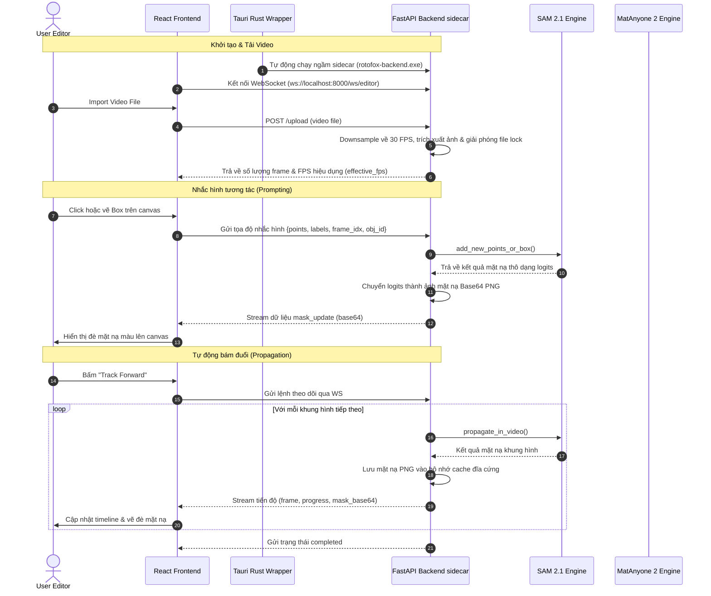

# KIẾN TRÚC HỆ THỐNG: SMARTMASK LOCAL
*(System Architecture Design)*

Tài liệu này mô tả chi tiết kiến trúc kỹ thuật của hệ thống SmartMask Local, giải thích luồng hoạt động, cấu trúc thành phần, phương thức giao tiếp và các cơ chế tối ưu hóa tài nguyên giữa giao diện người dùng và lõi xử lý AI nội bộ.

---

## 1. TỔNG QUAN KIẾN TRÚC (HIGH-LEVEL ARCHITECTURE)

SmartMask Local tuân theo mô hình **Local Hybrid Architecture**, phân tách rõ ràng giữa lớp Hiển thị (Frontend) và lớp Xử lý (Backend), đóng gói trong một ứng dụng Desktop duy nhất. 

- **Frontend (Tauri + React):** Đảm nhiệm việc hiển thị Video, tiếp nhận tương tác chuột (Clicks, Drags), quản lý Timeline và gửi lệnh qua API/WebSockets.
- **Backend (Python FastAPI):** Nhận lệnh từ Frontend, điều khiển phần cứng GPU/CPU xử lý hình ảnh qua 2 mô hình AI (SAM 2.1 & MatAnyone 2), và quản lý dữ liệu Video cache trên đĩa cứng (SSD).
- **Tauri Integration Process**: Khi ứng dụng chính mở ra, nhân Rust của Tauri tự động khởi chạy và chạy ngầm (sidecar) tiến trình Python backend độc lập (`rotofox-backend.exe`), giúp người dùng chỉ cần nhấp đúp chạy một file duy nhất mà không cần cài đặt hoặc khởi động môi trường Python riêng biệt.

---

## 2. BIỂU ĐỒ THÀNH PHẦN (COMPONENT DIAGRAM)

Biểu đồ dưới đây thể hiện sự liên kết giữa các cụm thành phần chính:

```mermaid
graph TD
    subgraph "Frontend (Tauri + React)"
        UI[User Interface]
        Canvas[Video & Mask Canvas]
        Timeline[Timeline Manager]
        WS_Client[WebSocket Client]
        
        UI --> Canvas
        UI --> Timeline
        Canvas --> WS_Client
        Timeline --> WS_Client
    end

    subgraph "Backend (Python FastAPI sidecar)"
        WS_Server[WebSocket Server]
        API[REST API endpoints]
        
        subgraph "AI Core Processing"
            SAM2["SAM 2.1 Service<br/>(Tracking & Segmentation)"]
            MatAnyone["MatAnyone 2 Service<br/>(Matting & Refinement)"]
        end
        
        subgraph "I/O & Storage Core"
            VideoUtil[OpenCV/FFmpeg Utils]
            Cache[(SSD Frame Cache)]
        end
        
        WS_Server <--> SAM2
        API --> VideoUtil
        VideoUtil --> Cache
        SAM2 <--> Cache
        MatAnyone <--> Cache
        SAM2 -->|Raw Mask| MatAnyone
    end

    WS_Client <==>|Bi-directional Data (JSON / Base64)| WS_Server
```

---

## 3. LUỒNG XỬ LÝ CHÍNH (DATA FLOWS)

Hệ thống có 4 luồng xử lý dữ liệu chính tương ứng với hành vi của người dùng:

### 3.1. Luồng Import Video (Khởi tạo)
1. Người dùng chọn file Video.
2. Frontend gửi request REST API `/upload` xuống Backend.
3. Backend thực hiện dọn dẹp cache cũ. Để tăng tính ổn định trên Windows, hàm xóa cache sử dụng chế độ `ignore_errors=True` trong `shutil.rmtree` để bỏ qua các file tạm đang bị hệ thống khóa.
4. Backend sử dụng **OpenCV** rã video thành chuỗi ảnh lưu vào thư mục `cache_workspace/video_<timestamp>/`.
   - **Tối ưu hóa FPS (Downsampling)**: Tự động giới hạn khung hình trích xuất tối đa là **30 FPS**. Đối với các video tốc độ khung hình cao (như 90 FPS của game thủ), cơ chế này giảm số lượng ảnh xuống còn 1/3 (giảm 66% dung lượng), ngăn chặn việc cạn kiệt RAM hệ thống (PyTorch CPU Allocator OOM) khi nạp frame.
   - **Giải phóng File Lock**: Đảm bảo tệp tin gốc `.mp4` được giải phóng ngay sau khi trích xuất bằng cách đặt lệnh đóng video trong khối `finally`, kết hợp giải phóng đối tượng (`del cap`) và gọi dọn rác thủ công (`import gc; gc.collect()`).
5. Trả về số lượng frame thực tế kèm theo tốc độ khung hình hiệu dụng (`effective_fps`) cho Frontend để đồng bộ dòng thời gian phát.

### 3.2. Luồng Tương Tác Chuột (Point-and-Click Inference)
Để đảm bảo trải nghiệm vẽ Mask theo thời gian thực (Zero-latency feel), chúng ta sử dụng **WebSockets**:
1. Người dùng Click chuột hoặc vẽ Bounding Box trên Canvas.
2. Frontend gửi tọa độ nhắc hình qua WebSocket: `{ action: "click", points, labels, box, frame_idx, obj_id }`.
3. Backend gọi hàm SAM 2 Predictor tính toán, trả về ma trận Binary Mask.
4. Backend mã hóa Mask thành ảnh Base64 PNG siêu nhẹ và đẩy qua WebSocket về Frontend.
5. Frontend hiển thị đè mặt nạ màu lên Video ngay lập tức.

### 3.3. Luồng Tracking Tự Động (Propagation)
Khi người dùng bấm nút Play / Track Forward để AI tự chạy qua các frame:



### 3.4. Luồng Tinh chỉnh Viền & Xuất Bản (Refinement & Export)
Luồng này thực hiện tiến trình tốn nhiều tài nguyên nhất và không yêu cầu Real-time:
1. Người dùng ấn nút **Export Transparent Video**.
2. Toàn bộ các mảng Mask thô (Binary Mask) từ SAM 2.1 được đẩy qua mô hình **MatAnyone 2**.
3. MatAnyone 2 đối chiếu ảnh gốc và Mask thô, tính toán các sợi tóc, hiệu ứng mờ nhòe (Motion Blur) để sinh ra **Alpha Matte** với mức độ chi tiết sub-pixel.
4. **FFmpeg** đọc các frame ảnh gốc và Alpha Matte, ghép chúng lại thành file `ProRes 4444 .mov` hoặc chuỗi ảnh mặt nạ trắng đen (Luma Matte).
5. Thông báo hoàn thành và lưu file vào máy người dùng.

---

## 4. CHIẾN LƯỢC QUẢN LÝ BỘ NHỚ VÀ HIỆU NĂNG

Vì chạy trên máy tính cá nhân (VRAM hữu hạn), hệ thống áp dụng các nguyên tắc tối ưu hóa khắt khe:

1. **Lazy Loading Model:** 
   SAM 2 và MatAnyone 2 sẽ không bị nạp vào GPU cùng lúc nếu không cần thiết. Trong lúc Tracking, chỉ SAM 2 nằm trên VRAM. Khi bấm Export, SAM 2 bị xóa khỏi VRAM để nhường chỗ cho MatAnyone 2.
   
2. **SSD Local Cache:** 
   Tránh nạp toàn bộ mảng Video Frame vào RAM máy tính (Có thể gây sập app với video dài). Dữ liệu được đọc ngẫu nhiên (Random read) từ SSD. Yêu cầu bắt buộc hệ thống nên được chạy trên SSD NVMe.

3. **Giới hạn FPS trích xuất (30 FPS Max)**:
   Giới hạn mặc định 30 FPS giúp tối ưu hóa đáng kể RAM CPU và VRAM GPU, giúp hệ thống hoạt động ổn định trên cả các dòng máy cấu hình trung bình/CPU-only mà không bị tràn bộ nhớ.

4. **Thu hồi tài nguyên triệt để**:
   Sau khi hoàn tất quá trình trích xuất hoặc theo dõi, hệ thống tự động giải phóng biến rác (`del`) và gọi bộ dọn rác của Python (`gc.collect()`) kết hợp dọn cache CUDA (`torch.cuda.empty_cache()`) để hạ lượng RAM/VRAM sử dụng khi nhàn rỗi về mức tối thiểu.
   
5. **Half-Precision (FP16/BF16):** 
   AI Engine mặc định chạy dưới dạng tính toán FP16/BF16 trên PyTorch (CUDA) để giảm một nửa lượng VRAM yêu cầu mà gần như không ảnh hưởng chất lượng.

---
*Tài liệu này sẽ được liên tục cập nhật trong quá trình tối ưu hóa mã nguồn.*
